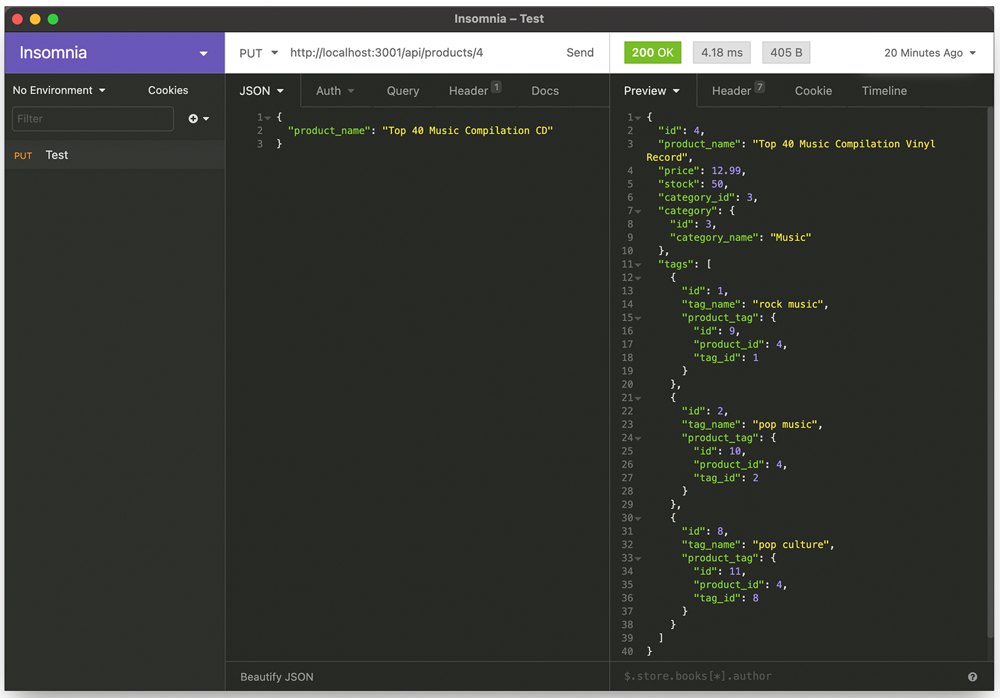

# E-commerce Back End


## Table of Contents
* [Description](#description)
* [Installation](#installation)
* [Usage](#built)
* [About The Developer](#about-the-developer)
  
## Description
Backend for an e-commerce website that allows management (viewing, adding, modifying and deleting) of categories, products and tags.

### Built with
* [MySQL](https://www.mysql.com/downloads/) 
* [Node.js](https://nodejs.org/en/)
  * [Express](https://www.npmjs.com/package/express)
  * [Node MySQL 2](https://www.npmjs.com/package/mysql2)
  * [Sequelize](https://www.npmjs.com/package/sequelize)
  * [dotenv](https://www.npmjs.com/package/dotenv)

### Tools Required
* A command lline application like “Terminal” (for the Mac - installed with the OS or [Git Bash](https://git-scm.com/downloads) for windows
* [Insomnia Core](https://insomnia.rest/download) for using the get, post, put and delete functions of the server

## Installation
Note: You must have MySQL installed to use this application. 
1. Using your comman line application, clone the GitHub repository. Once completed, in your terminal/batch application navigate to the folder it was cloned to. 
2. Run “npm install” to download and install the necessary node extensions. 
3. Run MySQL and enter “source db/schema.sql”. This will create the “ecommerce_db” database that you will be working with. Exit MySQL by typing “quit”. 
4. Enter “npm run seed”. This will set up and populate the tables in the database. 

## Usage
1. In your command line application enter “npm start” to launch the server.
2. Launch Insomnia Core. Enter the address for your application. If installed on your local machine it will likely be “ht<span>tp://local</span>host:3001”.
    1. To view the contents of any of the tables, make sure you have selected GET and navigate to the appropriate address “ht<span>tp://local</span>host:3001/api/categories” for the “category” table, “ht<span>tp://local</span>host:3001/api/products” for the “products table” a “ht<span>tp://local</span>host:3001/api/tags” for the “tags” table. To view a single item add it's id number to the end of the address (for example “ht<span>tp://local</span>host:3001/api/categories/1”)
    2. To add content, change the selection to POST and use the same addresses above. Select JSON from the “Body” menu and enter your data in JSON format:
        * For Categories: 
            ```
            {
                "category_name": "Your new category"
            }
            ```
        * For Products*:
            ```
            {
                "product_name": "Your product name",
                "price": 12.34,
                "stock": 56,
                "category_id": 1,
                "tagIds": [1,3]
            }
            ```
        * For Tags**:
            ```
            {
                "tag_name": "Your tag name.",
                "productIds": [1,2]
            }
            ```
    3. To update content, change the selection to PUT and use the same address as above, but add the id of the item you want to update to the end. For exaple if you want to update the product item with the id of 2, use the address ht<span>tp://local</span>host:3001/api/products/2”. Enter the approriate the JSON for content you want to update as in the format above. You only ned to include the parts you want to update. For example, if you want to update the price of a product you use: 
        ```
        { 
            "price": 43.21
        }
        ```
    4. To delete content, enter the appropriate address with the id number of the item you wish to delete attached to the end of the address (as above). Note: be careful when doing this. There is no prompt to make sure this is what you want to do and no option to undo afterwards.

*“category_id” associates the product with the selected category. “tagIds” associates your product with specific tags.\
**“productIds” associates your tag with specific products

[Click here](https://youtu.be/WOIz-BSQycc) to watch a sample video of the installation and usage of the database and server.
[](https://youtu.be/WOIz-BSQycc)

## About the Developer
This application was programmed by Eric Normann, a student in the Full Stack Web Development Bootcamp program at U of T. Learn more about this and other projects he is working on at his [GitHub](http://github.com/e-p-n) page. 

If you have any questions, please [email](mailto:eric.n@me.com?subject=Question%20regarding%20E-commerce%20Backend) Eric.
